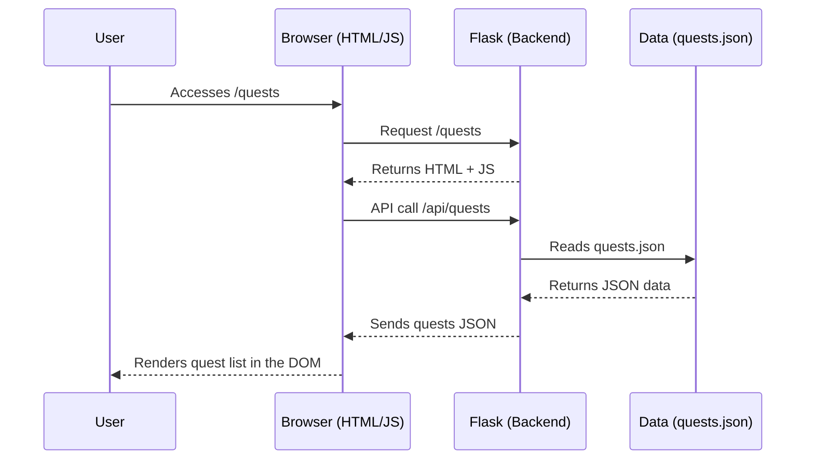

```mermaid
sequenceDiagram
    participant U as User
    participant B as Browser (HTML/JS)
    participant F as Flask (Backend)
    participant D as Data (quests.json)

    U->>B: Accesses /quests
    B->>F: Request /quests
    F-->>B: Returns HTML + JS
    B->>F: API call /api/quests
    F->>D: Reads quests.json
    D-->>F: Returns JSON data
    F-->>B: Sends quests JSON
    B-->>U: Renders quest list in the DOM
```
