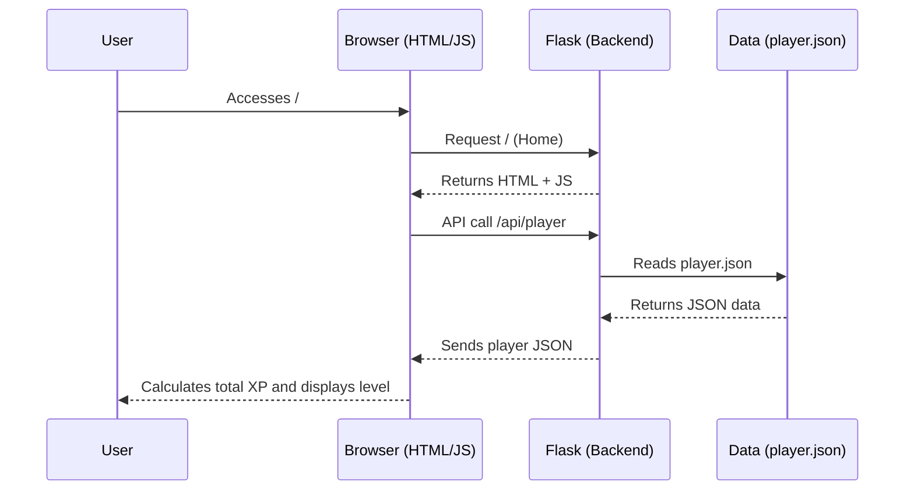

```mermaid
sequenceDiagram
    participant U as User
    participant B as Browser (HTML/JS)
    participant F as Flask (Backend)
    participant D as Data (player.json)

    U->>B: Accesses /
    B->>F: Request / (Home)
    F-->>B: Returns HTML + JS
    B->>F: API call /api/player
    F->>D: Reads player.json
    D-->>F: Returns JSON data
    F-->>B: Sends player JSON
    B-->>U: Calculates total XP and displays level
```
